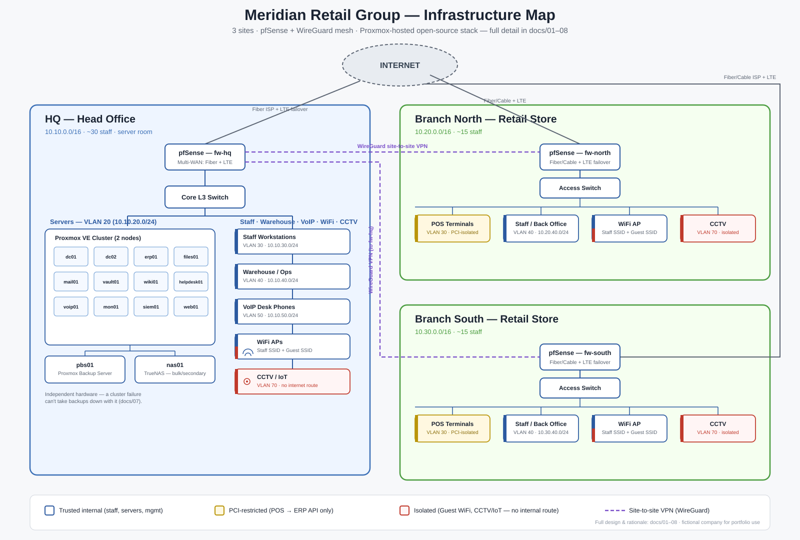
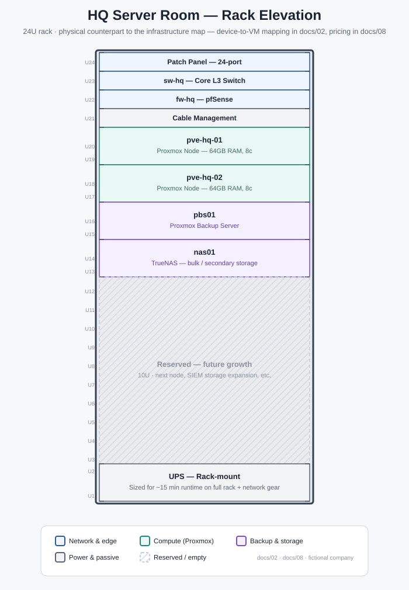

# Meridian Retail Group — Complete SMB IT Infrastructure

A full, from-scratch IT infrastructure design for a fictional 3-location small business — **network, servers, security, and the complete software stack** — built as a portfolio piece to demonstrate end-to-end IT/infrastructure engineering.

> **Company:** Meridian Retail Group — general merchandise retailer
> **Footprint:** Head Office (admin + warehouse) + 2 retail branches, ~60 staff, ~14 servers
> **Design philosophy:** Open-source / self-hosted first — every core service is a tool you can actually deploy and run today, at close to $0 in licensing.

This repo is a **design document + reference implementation**, not a live production system. Every diagram is real (Mermaid, renders on GitHub), every config is a real, working sample (pfSense rules, WireGuard, VLANs, Docker Compose), and every architectural decision is explained — the point is to show *how* and *why*, not just *what*.

<strong>Contents</strong>

- [Infrastructure Map](#infrastructure-map)
- [Skills Demonstrated](#skills-demonstrated)
- [Why This Exists](#why-this-exists)
- [Repo Map](#repo-map)
- [Start Here](#start-here)
- [Full Documentation Index](#full-documentation-index)
- [Diagrams](#diagrams)
- [Configs](#configs-real-samples-not-screenshots)
- [Architecture Decision Records](#architecture-decision-records)
- [At a Glance](#at-a-glance)
- [License](#license)

---

## Infrastructure map

One-page view of all 3 sites — devices, VLANs, and the VPN mesh together. The [logical software map](diagrams/logical-architecture.md) and [security zones map](diagrams/dataflow-security-zones.md) below go deeper on the application and trust-boundary layers this map doesn't show.

Physical layer — HQ rack elevation

 

What's actually mounted where in the server room — the physical counterpart to the logical map above. Maps 1:1 to the [server hardware table](docs/02-server-infrastructure.md#physical-layer) and [cost breakdown](docs/08-cost-and-bom.md).

---

## Skills demonstrated

Every row below is backed by a real doc or config in this repo, not just claimed — click through to see the actual work.

**Networking & Security**

| Skill | Where |
|---|---|
| Network segmentation & VLAN design | [01 — Network Architecture](docs/01-network-architecture.md), [VLAN Segmentation](diagrams/vlan-segmentation.md) |
| Firewall policy design (default-deny, least privilege) | [`firewall-rules-hq.md`](configs/pfsense/firewall-rules-hq.md) |
| Site-to-site VPN (WireGuard, hub-and-spoke) | [`wireguard-site-to-site.conf.sample`](configs/pfsense/wireguard-site-to-site.conf.sample) |
| IP addressing & subnetting at multi-site scale | [01 — Network Architecture](docs/01-network-architecture.md#ip-addressing-plan) |
| PCI-DSS-aware network design (POS isolation) | [05 — Security Architecture](docs/05-security-architecture.md#vlan-to-vlan-policy) |
| PCI DSS v4.0.1 scoping & control mapping (P2PE, SAQ P2PE) | [09 — PCI DSS Control Map](docs/09-pci-dss-control-map.md), [ADR-0008](docs/adr/0008-p2pe-terminals-for-pci-scope.md) |
| SIEM / EDR / log correlation (Wazuh) | [05 — Security Architecture](docs/05-security-architecture.md#siem--edr-wazuh), [`configs/docker-compose/wazuh/`](configs/docker-compose/wazuh/) |
| Switch VLAN/trunk configuration | [`vlan-config-sample.txt`](configs/switch/vlan-config-sample.txt) |

**Systems, Virtualization & Identity**

| Skill | Where |
|---|---|
| Virtualization & clustering (Proxmox VE) | [02 — Server Infrastructure](docs/02-server-infrastructure.md) |
| Directory services (Active Directory via Samba 4) | [03 — Identity & Access](docs/03-identity-and-access.md#directory-samba-4-active-directory) |
| SSO / MFA architecture (Authelia) | [03 — Identity & Access](docs/03-identity-and-access.md#single-sign-on-authelia) |
| Identity lifecycle management (joiner/mover/leaver) | [03 — Identity & Access](docs/03-identity-and-access.md#joiner--mover--leaver-process) |
| Linux systems administration & containerization | [`configs/docker-compose/`](configs/docker-compose/) |
| DHCP/DNS architecture | [01 — Network Architecture](docs/01-network-architecture.md#dhcp--dns), [`kea-dhcp4.conf.sample`](configs/dhcp/kea-dhcp4.conf.sample) |
| Infrastructure as Code — VM provisioning (Terraform + Proxmox) | [`iac/terraform/`](iac/terraform/) |
| Configuration management (Ansible — hardening, AD join, agents, app deploy) | [`iac/ansible/`](iac/ansible/) |
| CI/CD & configuration validation (GitHub Actions) | [`.github/workflows/lint.yml`](.github/workflows/lint.yml) |
| Patch management for pinned images (Dependabot) | [`.github/dependabot.yml`](.github/dependabot.yml) |

**Business Systems, Operations & Planning**

| Skill | Where |
|---|---|
| ERP/business-systems integration (accounting, inventory, POS, HR, CRM) | [04 — Software Stack](docs/04-software-stack.md#erpnext--the-core-of-the-business) |
| Infrastructure monitoring & alerting (Zabbix + Grafana) | [06 — Monitoring & Observability](docs/06-monitoring-observability.md) |
| Disaster recovery planning (RTO/RPO, runbooks) | [07 — Disaster Recovery](docs/07-disaster-recovery.md) |
| Backup architecture (3-2-1, tested restores) | [07 — Disaster Recovery](docs/07-disaster-recovery.md#the-3-2-1-chain), [Backup & DR Flow](diagrams/backup-dr-flow.md) |
| IT policy writing (AUP, password/MFA, retention) | [`policies/`](policies/) |
| Incident response (runbooks with containment, evidence, recovery) | [`runbooks/`](runbooks/) |
| Cost/TCO analysis & build-vs-buy reasoning | [08 — Cost & BOM](docs/08-cost-and-bom.md) |
| Technical documentation & systems diagramming | this repo, in full |

---

## Why this exists

Most "homelab" portfolios show one server running one app. Real SMB environments are a system: a WAN edge, segmented VLANs, a domain, centralized identity, a backup chain with a real RPO/RTO, and a dozen business-critical apps that all have to talk to each other securely across three sites. This project designs that whole system for a realistic small business, end to end.

## Repo map

| Folder | What's in it |
|---|---|
| [`docs/`](docs/) | The written design — company profile, network, servers, identity, software, security, monitoring, DR, cost |
| [`docs/adr/`](docs/adr/) | Architecture Decision Records — the trade-off reasoning behind the 8 biggest platform choices, downsides included |
| [`diagrams/`](diagrams/) | Mermaid network/architecture/data-flow diagrams (render natively on GitHub) |
| [`configs/`](configs/) | Real, working config samples — pfSense firewall rules, WireGuard site-to-site, VLANs, DHCP, Docker Compose stacks |
| [`iac/`](iac/) | Infrastructure as Code — Terraform provisions the server VMs on Proxmox, Ansible hardens them, joins them to AD, and deploys the stacks from `configs/` |
| [`policies/`](policies/) | The paperwork side of IT — AUP, password policy, backup retention |
| [`runbooks/`](runbooks/) | Incident runbooks — step-by-step response to ransomware, a lost or tampered POS device, and ISP failure |
| [`.github/workflows/`](.github/workflows/) | CI — validates every Compose stack, JSON config, Mermaid diagram, the Terraform and Ansible code, and every internal doc link on every push |

## Start here

1. **[Company Profile](docs/00-company-profile.md)** — the business this whole design is built for, and the requirements that drove every decision
2. **[Network Architecture](docs/01-network-architecture.md)** — topology, IP/VLAN plan, WAN, site-to-site VPN
3. **[Network Topology Diagram](diagrams/network-topology.md)** — the picture version of #2
4. **[Server Infrastructure](docs/02-server-infrastructure.md)** — virtualization, storage, the 14-VM service map
5. **[Software Stack](docs/04-software-stack.md)** — what runs the business day to day, and why each tool was picked
6. **[Security Architecture](docs/05-security-architecture.md)** — segmentation, SIEM, hardening, remote access
7. **[Disaster Recovery](docs/07-disaster-recovery.md)** — backup chain, RTO/RPO, the actual failover runbook

## Full documentation index

- [00 — Company Profile & Requirements](docs/00-company-profile.md)
- [01 — Network Architecture](docs/01-network-architecture.md)
- [02 — Server Infrastructure](docs/02-server-infrastructure.md)
- [03 — Identity & Access Management](docs/03-identity-and-access.md)
- [04 — Software Stack](docs/04-software-stack.md)
- [05 — Security Architecture](docs/05-security-architecture.md)
- [06 — Monitoring & Observability](docs/06-monitoring-observability.md)
- [07 — Disaster Recovery](docs/07-disaster-recovery.md)
- [08 — Cost & Bill of Materials](docs/08-cost-and-bom.md)
- [09 — PCI DSS Control Map](docs/09-pci-dss-control-map.md)
- [Incident runbooks](runbooks/) — ransomware, lost/tampered POS device, ISP failure

## Diagrams

- [**Infrastructure Map**](diagrams/assets/infrastructure-map.svg) — poster-style, single-page view of every site, device, VLAN, and the VPN mesh (shown above)
- [**Rack Elevation**](diagrams/assets/rack-elevation.svg) — the physical layer: what's mounted where in the HQ server room (shown above)
- [Network Topology](diagrams/network-topology.md) — all 3 sites, WAN edges, VPN mesh, core devices
- [VLAN Segmentation](diagrams/vlan-segmentation.md) — per-site VLAN layout and inter-VLAN policy
- [Logical Software Architecture](diagrams/logical-architecture.md) — every service and how users reach it
- [Security Zones & Data Flow](diagrams/dataflow-security-zones.md) — trust boundaries, DMZ, traffic flow
- [Backup & DR Flow](diagrams/backup-dr-flow.md) — the 3-2-1 backup chain end to end

## Configs (real samples, not screenshots)

- [`configs/pfsense/`](configs/pfsense/) — firewall rule tables, WireGuard site-to-site sample, VLAN interfaces
- [`configs/switch/`](configs/switch/) — VLAN/trunk config sample for a managed access switch
- [`configs/dhcp/`](configs/dhcp/) — Kea DHCPv4 config sample
- [`configs/docker-compose/`](configs/docker-compose/) — the self-hosted app stacks (monitoring, Nextcloud, Vaultwarden, plus Wazuh and Mailcow as overrides on their official bundles)
- [`iac/`](iac/) — Terraform + Ansible that build the server layer and deploy these configs ([how it fits together](iac/README.md))

## Architecture Decision Records

The "why this, not the alternative" boxes throughout `docs/` are summaries — the full trade-off reasoning, including the honest downsides of each choice, lives in [`docs/adr/`](docs/adr/):

- [ADR-0001](docs/adr/0001-pfsense-over-commercial-utm.md) — pfSense over a commercial UTM appliance
- [ADR-0002](docs/adr/0002-wireguard-over-ipsec.md) — WireGuard over IPsec for site-to-site VPN
- [ADR-0003](docs/adr/0003-proxmox-over-vmware.md) — Proxmox VE over VMware vSphere
- [ADR-0004](docs/adr/0004-samba-ad-over-cloud-idp.md) — Samba 4 AD over a cloud identity provider
- [ADR-0005](docs/adr/0005-erpnext-over-point-solutions.md) — ERPNext over point-solution SaaS
- [ADR-0006](docs/adr/0006-dhcp-local-per-site.md) — DHCP served locally per site, not centralized
- [ADR-0007](docs/adr/0007-ad-domain-subdomain-not-local.md) — AD domain as a `corp.` subdomain, not `.local`
- [ADR-0008](docs/adr/0008-p2pe-terminals-for-pci-scope.md) — P2PE card terminals, keeping the network out of PCI scope

## At a glance

| Layer | Choice | Why |
|---|---|---|
| Firewall / Router | pfSense (CE) | Free, enterprise-grade, huge community, does routing + firewall + VPN + IDS in one box |
| Site-to-site VPN | WireGuard (hub-and-spoke via HQ) | Modern, fast, tiny attack surface, native in pfSense |
| Virtualization | Proxmox VE | Free KVM hypervisor with clustering, snapshots, and a built-in backup story |
| Identity | Samba 4 Active Directory | Real AD (Kerberos/LDAP/GPO) compatible with Windows clients, at $0 |
| ERP / POS / Accounting / Inventory / HR / CRM | ERPNext | One system covering nearly every back-office function — avoids 6 separate SaaS subscriptions |
| File sync/share | Nextcloud | Dropbox-equivalent, self-hosted, mobile + desktop clients |
| Email | Mailcow | Full mail server (SMTP/IMAP + webmail + spam filtering) in a Docker stack |
| Monitoring | Zabbix + Grafana | Infrastructure monitoring + alerting with real dashboards |
| SIEM / EDR | Wazuh | Log correlation, file integrity monitoring, active response |
| Backup | Proxmox Backup Server + TrueNAS + offsite object storage | A real 3-2-1 chain, not "just snapshots" |

## License

Documentation and configs in this repo are provided under the [MIT License](LICENSE) — reuse, adapt, and build on it freely.

---

*This is a portfolio/reference design. Company name, domain names (`meridianretail.com`), addresses, and IP ranges are fictional. Config samples are meant to be read and adapted, not copy-pasted into a production network without review.*
