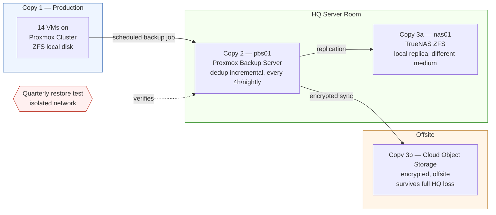

# Backup & DR Flow

Full design context: [07 — Disaster Recovery](../docs/07-disaster-recovery.md)

## The 3-2-1 chain, end to end

## Read this diagram as

- **3 copies:** production (the running VM), `pbs01` (primary backup), and the NAS + cloud pair (secondary/offsite) — losing any one copy still leaves two others.
- **2 media types:** the Proxmox cluster's ZFS and PBS's dedup datastore are architecturally distinct from the NAS's separate ZFS array — a filesystem-level or backup-software bug affecting one doesn't affect the other.
- **1 offsite:** the cloud object storage copy is the only one that survives HQ itself being destroyed (fire/flood/theft) — this is the copy the [DR runbook](../docs/07-disaster-recovery.md#dr-runbook-full-hq-site-loss-summary) pulls from in a full-site-loss scenario.
- **The quarterly restore test isn't decorative** — a backup chain with no tested restore path is, per [07 — Disaster Recovery](../docs/07-disaster-recovery.md#backup-testing), not actually trusted to work until it's been proven to.
