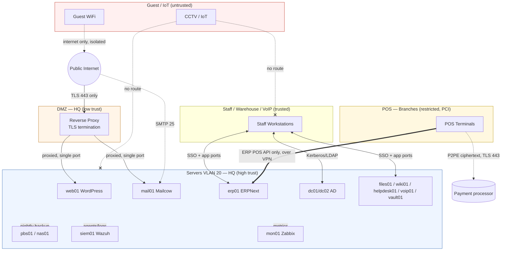

# Security Zones & Data Flow

Full design context: [05 — Security Architecture](../docs/05-security-architecture.md)

## Trust boundaries and traffic flow

## Read this diagram as

- **The DMZ is a chokepoint, not a shortcut.** The only path from the public internet to any internal server is through the reverse proxy, and the reverse proxy itself can only reach the one backend port it's meant to proxy — a compromised `web01` or reverse proxy still can't pivot to `erp01` or the domain controllers.
- **POS traffic is two narrow arrows** — the ERPNext POS API over the site-to-site VPN, and the card readers' P2PE-encrypted link to the payment processor, nothing else. Card data is encrypted inside the reader ([ADR-0008](../docs/adr/0008-p2pe-terminals-for-pci-scope.md)), so those arrows are the second layer of the PCI control referenced in [00 — Company Profile](../docs/00-company-profile.md) and detailed in [05 — Security Architecture](../docs/05-security-architecture.md#vlan-to-vlan-policy).
- **CCTV/IoT has hard "no route" edges (✗)** to both the server VLAN and staff VLAN — not "restricted," but architecturally absent. Even a fully compromised camera has nowhere to go except the isolated VLAN it's already on.
- **Every server-side node feeds three ops systems** (Wazuh for security, Zabbix for health, Proxmox Backup Server for recovery) regardless of what the service does — visibility and recoverability are baked into the platform, not bolted on per-app.
