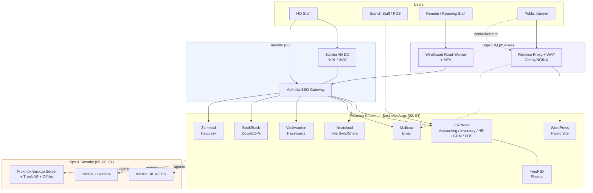

# Logical Software Architecture

Full design context: [02 — Server Infrastructure](../docs/02-server-infrastructure.md), [04 — Software Stack](../docs/04-software-stack.md)

## Every service, and how users reach it

## Read this diagram as

- **One identity, one login.** Samba AD is the source of truth for who staff are; Authelia sits in front of every self-hosted web app as an SSO + MFA gateway, so staff log in once instead of juggling per-app passwords. Detail: [03 — Identity & Access](../docs/03-identity-and-access.md).
- **Branch staff and POS terminals talk to ERPNext directly** over the site-to-site VPN (not through the public internet) — this is the same ERPNext instance serving accounting, inventory, HR, CRM, *and* the POS terminals at both branches.
- **Remote/roaming staff** (e.g. a manager working from home) connect via a separate WireGuard road-warrior profile with MFA, landing behind the same SSO gateway as everyone else — no special-cased access path.
- **The public internet only ever reaches two things**: the reverse-proxied public website, and inbound email — everything else is unreachable from outside without a VPN connection first.
- **Every app is watched two ways**: metrics/uptime by Zabbix+Grafana ([06](../docs/06-monitoring-observability.md)), security events by Wazuh ([05](../docs/05-security-architecture.md)) — and everything backs up nightly to Proxmox Backup Server, replicated onward per the [DR plan](../docs/07-disaster-recovery.md).
