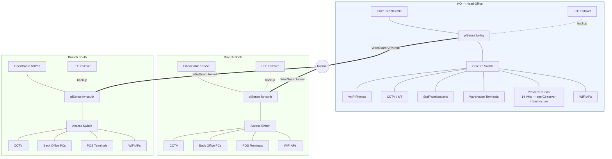

# Network Topology

Full design context: [01 — Network Architecture](../docs/01-network-architecture.md) · See also the single-page [Infrastructure Map](assets/infrastructure-map.svg) for a poster-style view of all 3 sites together.

## All 3 sites, WAN edges, and the VPN mesh

## Read this diagram as

- **HQ is the hub.** It holds the only server room and is the WireGuard hub both branches tunnel into (hub-and-spoke, not full mesh — branches never talk directly to each other).
- **Every site has WAN failover** (primary fiber/cable + LTE backup on pfSense multi-WAN), so a single ISP outage at any site doesn't take it fully offline.
- **Branches are thin sites.** No local servers beyond the firewall/switch/AP — everything (AD auth, ERP/POS backend, file shares, email, phones) is centrally hosted at HQ and reached over the VPN. Local DHCP/routing keeps branches functional for local traffic even if the HQ link drops (see [01 — Network Architecture](../docs/01-network-architecture.md#dhcp--dns)).
- **IP plan:** HQ = `10.10.0.0/16`, Branch North = `10.20.0.0/16`, Branch South = `10.30.0.0/16`. Full VLAN breakdown in [VLAN Segmentation](vlan-segmentation.md).
