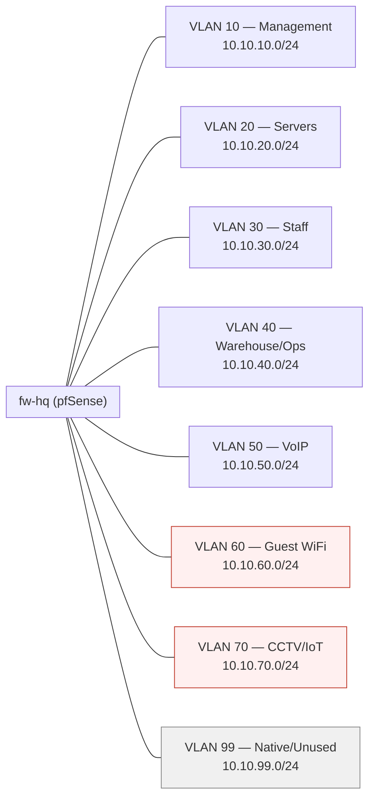
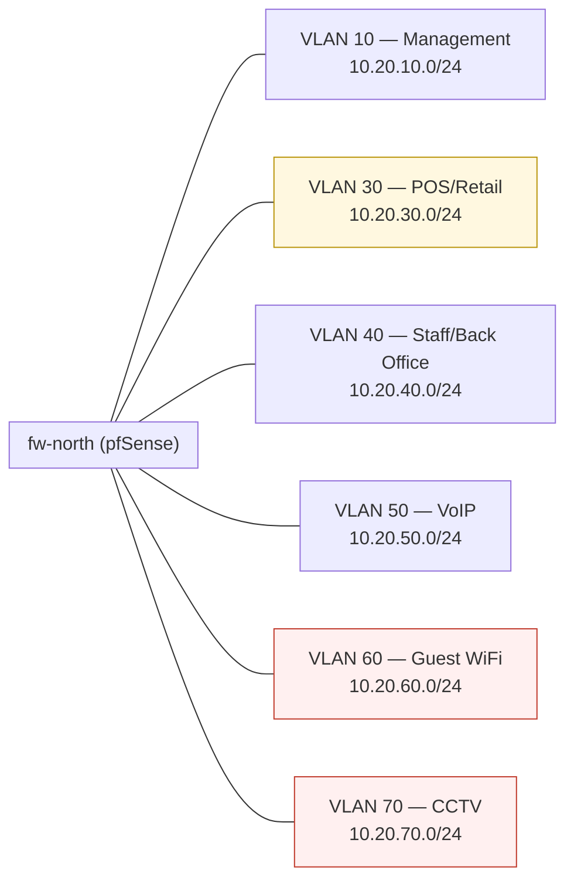

# VLAN Segmentation

Full design context: [01 — Network Architecture](../docs/01-network-architecture.md#ip-addressing-plan), firewall policy detail: [05 — Security Architecture](../docs/05-security-architecture.md#vlan-to-vlan-policy)

## HQ VLAN layout

## Branch VLAN layout (North shown — South identical, `10.30.x.0/24`)

**Color key:** red = fully isolated from internal network (guest, CCTV/IoT — internet/NVR only, no route to staff/server VLANs); amber = PCI-sensitive, allowed only to the specific ERP POS API port at HQ, nothing else.

## Inter-VLAN policy summary

| From ↓ / To → | Servers (HQ) | Staff | Warehouse | VoIP | POS (branch) | Guest | CCTV/IoT | Internet |
|---|:---:|:---:|:---:|:---:|:---:|:---:|:---:|:---:|
| Staff | ✅ (app ports) | ✅ | ✅ | ✅ | ❌ | ❌ | ❌ | ✅ |
| Warehouse/Ops | ✅ (ERP only) | ❌ | ✅ | ❌ | ❌ | ❌ | ❌ | ❌ |
| POS (branch) | ✅ (ERP POS API only) | ❌ | ❌ | ❌ | ✅ (same site) | ❌ | ❌ | ❌ |
| VoIP | ✅ (SIP/RTP to PBX only) | ❌ | ❌ | ✅ | ❌ | ❌ | ❌ | ❌ |
| Guest WiFi | ❌ | ❌ | ❌ | ❌ | ❌ | ✅ (isolated) | ❌ | ✅ |
| CCTV/IoT | ❌ | ❌ | ❌ | ❌ | ❌ | ❌ | ✅ (NVR only) | ❌ |
| Management | ✅ | ❌ | ❌ | ❌ | ❌ | ❌ | ❌ | ✅ (updates only) |

This matrix is enforced by explicit firewall rules on each site's pfSense — the VPN tunnel makes subnets *reachable* across sites, but these rules decide what's actually *permitted*. Full rule tables: [`configs/pfsense/firewall-rules-hq.md`](../configs/pfsense/firewall-rules-hq.md) and [05 — Security Architecture](../docs/05-security-architecture.md).
